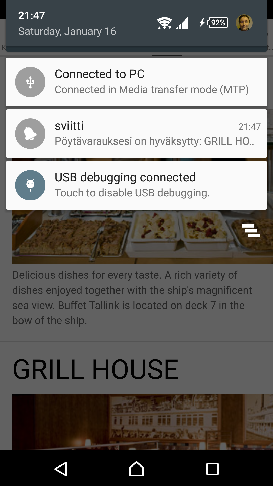

Copyright: Cybercom Finland Oy

License: ISC

Run with:
> docker-compose up

Features
========

- CouchDB
- Facebook login, or login with nick name
- Bluetooth Low-Energy
- Bluetooth (plain)
- WLAN
- Notifications
- Ship visualization
- Export PNGs of the ship layout layers for faster use.
- Connect Bluetooth MACs to user profiles and locations.
- Defined WLAN BSSID-locations.
- Faking indoors-positioning for debugging and testing.
- Faking Bluetooth id for debugging and testing.
- Faking Facebook authentication for debugging and testing.
- Show own location.
- Show friend locations.
- Show nearby friends.
- Restaurant reservations.

Theme music for the competition
===============================

- [silja14.sng](media/silja14.sng)
- [silja14.sid](media/silja14.sid)
- [silja14.wav](media/silja14.wav)
- [silja14.avi](media/silja14.avi)

Screenshots
===========

TODO
====

- Manage friends.
- Interactive pop ups for location circles.
- Send/receive messages from nearby friends with Socket.io.
- QR/NFC
- Test the whole stack
- Configurable modules
